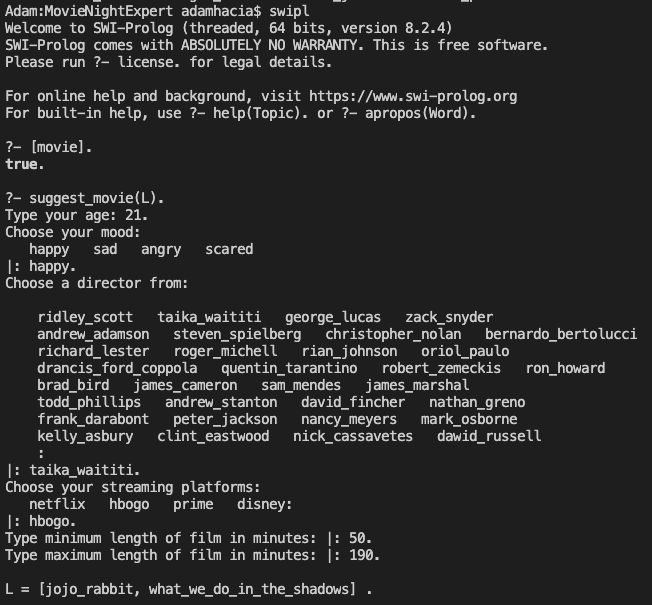
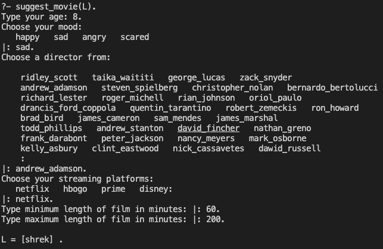

# Movie Night Expert

## Spis Treści
- [Movie Night Expert](#movie-night-expert)
  - [Spis Treści](#spis-treści)
  - [Zespół](#zespół)
  - [Założenia systemu](#założenia-systemu)
  - [Procedury](#procedury)
  - [Moduł wnioskujący](#moduł-wnioskujący)
  - [Sposób uruchomienia](#sposób-uruchomienia)
  - [Przykładowe wywołanie](#przykładowe-wywołanie)
  - [Contact](#contact)

## Zespół
* Adam Hącia 
* Aleksander Piaskowksi

## Założenia systemu

Movie Night Expert, to system ekspertowy (ekspercki), 
który na podstawie ulubionego gatunku, wieku użytkownika, humoru, posiadanej platformy streamingowej i preferowanej długości doradzi odpowiedni film na piątkowy wieczór. Cały projekt znajduje się w jednym pliku o nazwie `movie.pl`.

## Procedury
`elem(X,List)` - sprawdza czy element naley do listy

`elems(List1,List2` - sprawdza, czy listy mają jakiś wspólny element

`list_movie` - procedura, która zwraca listę odpowiednich filmów pasujących do preferencji użytkownika

`suggest_movie(L)` - główna procedura zadająca pytania użytkownikowi, zwracająca listę odpowiednich filmów poprzez wywołanie procedury `list_movie`

`get_category` - procedura zwracająca odpowiednie kategorie dla danego wieku

`get_theme` - procedura zwracająca odpowiednie gatunki dla danego humoru użytkownika

## Moduł wnioskujący
Moduły wnioskujące wyglądają następująco:
* Wnioskowanie kategorii wiekowych na podstawie wieku
```prolog
get_category(Age,X) :- Age < 7, X = [g].
get_category(Age,X) :- Age > 6, Age < 13, X = [g,pg].
get_category(Age,X) :- Age > 12, Age < 16, X = [g,pg,pg13].
get_category(Age,X) :- Age > 15, Age < 18, X = [g,pg,pg13,r].
get_category(Age,X) :- Age > 17, X = [g,pg,pg13,r,nc17].
```

* Wnioskowanie gatunków na podstawie humoru
```prolog
get_theme(Mood,X) :- 
    Mood = happy, 
    X = [horror,comedy,action,sci-fi,animation,fantasy,war,musical,romance].

get_theme(Mood,X) :-
    Mood = sad,
    X = [comedy,family,mystery,animation,fantasy,musical].

get_theme(Mood,X) :-
    Mood = scared,
    X = [family,fantasy,musical].

get_theme(Mood,X) :-
    Mood = angry,
    X = [comedy,family,sci-fi,animation,drama,musical].
```

* Wybieranie odpowiednich filmów z bazy danych
```prolog
list_movie(Director,Categories,Min,Max,Stream,Theme, Acc, L) :-
    movie(Movie,Director,Category,Length,Streamings,Themes),
    elems(Theme,Themes),
    elem(Stream,Streamings),
    elem(Category,Categories),
    Length > Min,
    Length < Max,
    \+ elem(Movie, Acc), !,
    list_movie(Director,Categories,Min,Max,Stream,Theme,[Movie|Acc], L). 
```
Filmy dobieramy w następujący sposób:
- wyprodukowane przez reżysera podanego przez użytkownika
- mające kategorię wiekową odpowiednią dla użytkownika
- będące długości zawartej w preferencjach użytkownika
- będące na platformie streamingowej dostępnej przez użytkownika
- będące filmami z co najmniej jednego gatunku, jakie zostały wywnioskowane na podstawie humoru użytkownika


## Sposób uruchomienia
1. Wpisujemy `swipl` w terminalu.
2. Wczytujemy plik za pomocą polecenie `[movie.pl].`
3. Wywołujemy funkcję `suggest_movie(X).`
4. Odpowiadamy na zadane pytania, kończąc swoją odpowiedź kropką` .` przykładowo odpowiadając na pytanie `Type your age: `, możemy odpowiedź za pomocą `21.`
5. Po odpowiedzeniu na wszystkie pytania wyświetli się lista proponowanych filmów na piątkowy wieczór.

## Przykładowe wywołanie




## Contact
Created by [Adam Hącia](https://hacia.students.wmi.amu.edu.pl/) and [Aleksander Piaskowski](#) 
2021